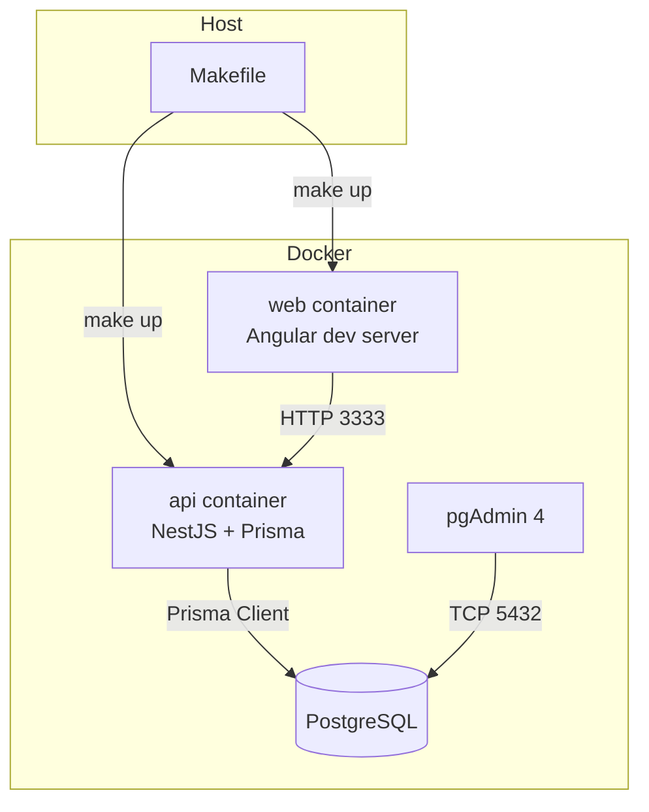

# Fullstack Starter · Angular 17 + NestJS 10 + Prisma + Nx

A production-ready mono-repo that scaffolds a modern Angular front end and NestJS API with shared types, PostgreSQL via Prisma, Docker-based local infrastructure, and GitHub Actions CI.


## ✨ Highlights

- **Angular 17** standalone application with routing, HttpClient interceptors, and role-aware guards.
- **NestJS 10** modular API with DTO validation, Swagger docs, JWT auth, and refresh tokens.
- **Prisma + PostgreSQL** schema-managed database with seed data and typed client.
- **Nx workspace** for consistent tooling, caching, and project graph visibility.
- **Shared contracts** in `packages/types` consumed by both the web and API layers.
- **Testing ready**: Jest for the API, Cypress for the web smoke suite.
- **Dockerized** dev stack (`web`, `api`, `db`, `pgadmin`) with hot reload and Makefile shortcuts.
- **CI/CD**: GitHub Actions pipeline to install, lint, test, and build both apps while storing artifacts.

## 🚀 Quick start

```bash
make up
```

The command above builds the Docker images and starts the Angular app on [http://localhost:4200](http://localhost:4200), the Nest API on [http://localhost:3333/api](http://localhost:3333/api), PostgreSQL on `localhost:5432`, and pgAdmin on [http://localhost:5050](http://localhost:5050).

Default credentials from the seed data:

| Role  | Email               | Password |
| ----- | ------------------- | -------- |
| Admin | `admin@example.com` | `changeme` |
| User  | `member@example.com` | `changeme` |

> ℹ️  Copy `.env.example` to `.env` if you want to override JWT secrets or database URLs.

## 🧱 Repository layout

```
├── apps/
│   ├── api/          # NestJS application (DTOs, modules, Prisma services)
│   ├── web/          # Angular standalone app (routes, guards, services)
│   └── web-e2e/      # Cypress smoke tests for the web UI
├── packages/
│   └── types/        # Shared TypeScript contracts (Auth, Project, Task, pagination)
├── prisma/           # Prisma schema, migrations, and seed script
├── docker/           # Dockerfiles for API and web dev containers
├── .github/workflows # CI definitions
└── Makefile          # Convenience commands (start, test, lint, prisma)
```

## 🗺️ Architecture

```mermaid
graph LR
  A[Angular Web] -- HttpClient --> B[NestJS API]
  B -- Prisma Client --> C[(PostgreSQL)]
  B -- Shared DTOs --> D[@fullstack/types]
  A -- Shared DTOs --> D
```

### Environment topology



### Runtime flow

1. Users authenticate via `/api/auth/login`, receiving access & refresh JWTs.
2. The Angular interceptor attaches the access token to subsequent requests.
3. Route guards enforce role-based access (guest, member, admin).
4. Projects and tasks APIs support pagination, filtering, and CRUD with ownership checks.
5. Refresh tokens rotate transparently through `/api/auth/refresh`.

## 🛠️ Development commands

| Task | Command |
| ---- | ------- |
| Install dependencies | `npm install` |
| Start API only | `npm run start:api` |
| Start Web only | `npm run start:web` |
| Run Prisma Studio | `npx prisma studio` |
| Generate Prisma client | `make prisma-generate` |
| Seed the database | `make prisma-seed` |
| Run API unit tests | `nx test api` |
| Run Angular Jest tests | `nx test web` |
| Run Cypress e2e | `nx e2e web-e2e` |
| Format sources | `make format` |
| Lint check (format check) | `make lint` |

When running locally without Docker, ensure PostgreSQL is available and `DATABASE_URL` is exported.

## 🔐 API usage examples

### Register

```http
POST /api/auth/register
Content-Type: application/json

{
  "email": "new.user@example.com",
  "password": "Sup3rStr0ng!",
  "name": "New User"
}
```

### Login

```http
POST /api/auth/login
Content-Type: application/json

{
  "email": "admin@example.com",
  "password": "changeme",
  "rememberMe": true
}
```

### List projects

```http
GET /api/projects?page=1&pageSize=10&status=active
Authorization: Bearer <ACCESS_TOKEN>
```

### Create task

```http
POST /api/tasks
Content-Type: application/json
Authorization: Bearer <ACCESS_TOKEN>

{
  "title": "Wireframe dashboard",
  "projectId": "project-one",
  "status": "in_progress",
  "dueDate": "2024-09-01"
}
```

Swagger docs are available at [http://localhost:3333/api/docs](http://localhost:3333/api/docs).

## 🧪 Testing

- **API (Jest)**: `nx test api`
- **Web (Jest)**: `nx test web`
- **End-to-end (Cypress)**: `nx e2e web-e2e`

GitHub Actions automatically runs unit tests, e2e smoke tests, and archives build artifacts for both the API and web applications.

## 📦 Deployment notes

- Build optimized bundles: `nx build api` & `nx build web`.
- Use `docker compose -f docker-compose.yml --profile prod up` (extend the compose file) to orchestrate production containers.
- Set strong secrets for `JWT_SECRET` and `JWT_REFRESH_SECRET`.
- Configure a managed PostgreSQL instance and point `DATABASE_URL` accordingly.

## 🧭 Troubleshooting

- Prisma migrations may require running `npx prisma migrate dev` before seeding.
- If Angular fails to reach the API from Docker, ensure the API service is running on `http://api:3333` within the Docker network; from the host it remains `http://localhost:3333`.
- Reset the database with `docker compose down -v` to clear data volumes.

## 📄 License

MIT © 2024 Fullstack Starter contributors
